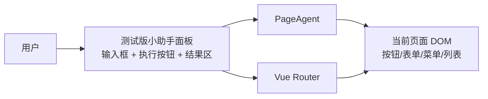
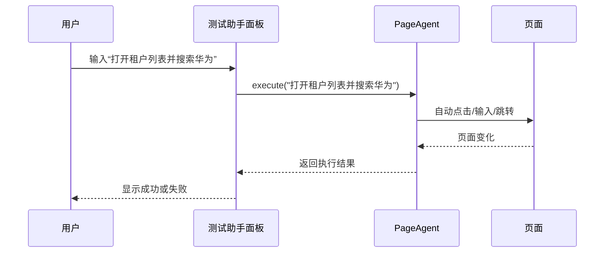

# 智慧园区项目接入 `page-agent` 轻量测试方案

## 1. 调整后的目标

当前策略改为：

- **废弃旧的 `smart-park-assistant` 小助手方案**
- **暂不建设后端 agent 服务**
- **只引入 `page-agent`**
- **在前端写一个最简单的测试版小助手面板**

目标不是一步做到完整智能助手，而是先验证这件事：

> 在你们现有智慧园区前端页面里，用户输入一句自然语言，`page-agent` 能不能稳定地帮我们操作页面。

这个阶段强调的是：

- 接入最轻
- 改造最少
- 尽快看到效果
- 方便后续再决定是否升级为正式产品能力

---

## 2. 为什么现在要改成轻量方案

如果当前只是要“先测一下 `page-agent` 到底好不好用”，那原来的方案确实偏重：

- 旧助手 SDK 需要维护
- 后端 agent 服务要额外开发
- 任务编排、权限控制、日志审计都会拉长验证周期

而你现在真正想验证的是：

1. `page-agent` 和你们这套 Vue 中后台是否适配
2. 它对菜单、列表、表单、审批页的识别效果怎么样
3. 它在真实业务页面上的稳定性够不够
4. 哪些页面需要补稳定标识才能用得更顺

所以这个阶段最优解是：

**直接上前端纯本地测试版。**

---

## 3. 新方案的核心原则

这次方案只保留三层：

1. 用户
2. 测试版小助手面板
3. `page-agent`

不再引入：

- 旧 `smart-park-assistant-sdk`
- 后端 `agent service`
- 复杂编排逻辑
- 多系统工具调用

一句话理解：

> 这次先做一个“浏览器内测试助手”，它本质上只是 `page-agent` 的一个轻量 UI 壳。

---

## 4. 轻量测试版总体架构



### 角色说明

#### 1）测试版小助手面板

负责：

- 展示一个简单浮层或抽屉
- 提供输入框让用户写指令
- 点击按钮执行指令
- 展示执行中 / 成功 / 失败结果
- 可内置几个快捷指令按钮

#### 2）`page-agent`

负责：

- 理解当前页面元素
- 执行自然语言指令
- 完成点击、输入、选择、导航等操作

#### 3）Vue Router

负责：

- 页面路由切换
- 让 `page-agent` 在 SPA 场景里能操作当前页面

---

## 5. 与旧方案相比，明确删掉什么

这次请明确把下面内容从规划里拿掉：

### 不再考虑

- `smart-park-assistant-sdk` 作为长期方案
- `serverUrl`
- `apiKey`
- `POST /api/agent/chat`
- `POST /api/agent/confirm`
- `POST /api/agent/events`
- 后端大模型代理
- 后端任务编排
- 审计日志系统

### 改成什么

改成前端直接初始化 `PageAgent`：

```js
import { PageAgent } from "page-agent";

const agent = new PageAgent({
  model: "qwen3.5-plus",
  baseURL: "https://dashscope.aliyuncs.com/compatible-mode/v1",
  apiKey: "YOUR_API_KEY",
  language: "zh-CN",
});

await agent.execute("打开租户列表并搜索华为");
```

注意：

- 这个阶段 API Key 先放在前端只用于测试
- **仅适合本地验证，不适合正式上线**

---

## 6. 推荐的新落地方式

## 6.1 入口改造策略

当前 `frontend/src/main.js` 里还在初始化旧助手：

- `import { SmartAssistant } from 'smart-park-assistant'`
- `assistant.init()`

新的轻量方案建议改成：

- 去掉旧助手依赖
- 直接在前端新增一个简单组件，例如：
  - `frontend/src/components/PageAgentTester.vue`
- 在 `App.vue` 或 `Layout.vue` 中挂载这个测试组件

---

## 6.2 推荐新增的最小文件

建议只新增/改造这些内容：

```text
frontend/src/
├── components/
│   └── PageAgentTester.vue      # 测试版小助手面板
├── utils/
│   └── pageAgent.js             # PageAgent 初始化与执行封装
├── App.vue 或 Layout.vue        # 挂载测试面板
└── main.js                      # 去掉旧助手 SDK 初始化
```

如果你想更快，也可以不拆 `utils/pageAgent.js`，全部先写在组件里。

---

## 7. 轻量版功能边界

这个测试版小助手只做三件事：

### 1. 输入自然语言指令

例如：

- 打开租户列表
- 搜索华为租户
- 进入合同审批页面
- 点击新增楼栋按钮

### 2. 直接调用 `page-agent.execute()`

不再经过后端拆解，用户输入什么，就直接交给 `page-agent`。

### 3. 显示结果

显示以下状态即可：

- 待输入
- 执行中
- 执行成功
- 执行失败

这已经足够支撑首轮验证。

---

## 8. MVP 最小交互设计

建议做一个非常简单的浮动面板。

## 8.1 界面结构

- 一个右下角悬浮按钮
- 点击后展开面板
- 一个多行输入框
- 一个“执行”按钮
- 一个执行状态区
- 三到五个快捷测试指令按钮

例如快捷指令：

- 打开租户列表
- 搜索华为租户
- 打开项目列表
- 进入合同审批页面
- 打开楼栋列表

## 8.2 最小交互流程



---

## 9. 第一阶段建议测试哪些页面

优先选结构最规则、最容易判断成功与失败的页面。

### 第一批推荐页面

1. `frontend/src/views/Login.vue`
2. `frontend/src/views/tenant/TenantList.vue`
3. `frontend/src/views/project/ProjectList.vue`
4. `frontend/src/views/asset/BuildingList.vue`
5. `frontend/src/views/contract/ContractApproval.vue`

### 这些页面分别验证什么

| 页面                   | 验证点                     |
| ---------------------- | -------------------------- |
| `Login.vue`            | 输入框识别、按钮点击       |
| `TenantList.vue`       | 搜索框、查询按钮、列表操作 |
| `ProjectList.vue`      | 菜单跳转与搜索             |
| `BuildingList.vue`     | 列表搜索和详情入口         |
| `ContractApproval.vue` | 表格操作、审批按钮定位能力 |

---

## 10. 这次不建议一开始做的事

为了保证验证效率，下面这些都先不要做重：

- 不要先做复杂聊天记录
- 不要先做多轮对话记忆
- 不要先做后端意图识别
- 不要先做审批自动确认流
- 不要先做权限中心
- 不要先接审计日志
- 不要先追求通用化 SDK 产品能力

这轮的唯一目标是：

> 验证 `page-agent` 在你们真实页面上的可操作性和稳定性。

---

## 11. 页面稳定性优化建议

虽然这次只做测试版，但为了让成功率高很多，还是建议给关键元素加稳定标识。

## 11.1 推荐加什么

优先加：

- `data-agent`
- `data-testid`
- `aria-label`

## 11.2 第一批建议补标识的元素

### 登录页

- 用户名输入框
- 密码输入框
- 登录按钮

### 列表页

- 搜索输入框
- 查询按钮
- 重置按钮
- 新增按钮
- 第一行详情按钮

### 合同审批页

- 待审批筛选项
- 查询按钮
- 审批通过按钮
- 审批驳回按钮

### 示例

```html
<el-input data-agent="login-username" />
<el-input data-agent="login-password" />
<el-button data-agent="login-submit">登录</el-button>
```

这一步不是必须先做，但如果测试中发现识别不稳定，就应该优先补。

---

## 12. 轻量版实施步骤

推荐按下面顺序推进。

## Step 1：前端安装 `page-agent`

在 `frontend` 中安装 `page-agent`。

目的：

- 验证依赖可正常打包到 Vite 项目
- 验证能在浏览器环境初始化

## Step 2：移除旧助手接入

在 `frontend/src/main.js` 中：

- 删除 `smart-park-assistant` 的 import
- 删除旧 `assistant.init()` 初始化逻辑

目的：

- 避免两个助手逻辑并存
- 保持验证面清晰

## Step 3：新增测试面板组件

新增 `PageAgentTester.vue`，包含：

- 输入框
- 执行按钮
- 快捷指令按钮
- 执行状态展示

## Step 4：封装 `page-agent` 初始化

建议在 `frontend/src/utils/pageAgent.js` 中统一封装：

- 单例创建
- `executeInstruction(text)` 方法
- 错误包装

## Step 5：挂载到页面

建议挂在 `App.vue` 或 `Layout.vue`。

如果希望登录页也验证，则挂 `App.vue` 更合适。

## Step 6：挑 3~5 个页面做场景验证

重点看：

- 页面跳转是否稳定
- 搜索是否稳定
- 按钮定位是否稳定
- 异步加载后是否还能继续执行

---

## 13. 最小实现合同

为了让开发收敛，可以把这个测试版小助手的输入输出先约定得非常简单。

## 输入

- 用户输入的一段自然语言

例如：

```text
打开租户列表并搜索华为
```

## 输出

- 成功：返回执行成功信息
- 失败：返回错误信息

例如：

```json
{
  "success": true,
  "message": "已执行：打开租户列表并搜索华为"
}
```

或：

```json
{
  "success": false,
  "message": "未能定位查询按钮，请检查页面元素标识"
}
```

---

## 14. 推荐的快捷指令集合

为了更快验证，建议先在测试面板内置以下快捷指令：

1. 打开租户列表
2. 搜索华为租户
3. 打开项目列表
4. 打开楼栋列表
5. 进入合同审批页面
6. 打开第一条租户详情

如果这些命令都能比较稳定执行，说明这条路线值得继续投入。

---

## 15. MVP 验收标准

只要满足下面这些，就可以认为第一轮验证成功：

- [ ] 页面右下角能正常显示测试助手入口
- [ ] 输入一条指令后能触发 `page-agent.execute()`
- [ ] 可以完成至少 3 个页面跳转类动作
- [ ] 可以完成至少 2 个列表搜索类动作
- [ ] 出错时界面能显示失败原因
- [ ] 刷新页面后测试面板仍可继续使用

加分项：

- [ ] 登录页可以自动填充并点击登录
- [ ] 合同审批页可以定位到目标按钮

---

## 16. 现阶段的风险提醒

这个方案虽然轻，但有几个明确边界：

### 1. API Key 前端暴露

测试阶段可以接受，正式环境不建议这样做。

### 2. 不适合直接做高风险自动操作

例如：

- 删除
- 审批
- 批量提交

本轮仅建议验证“能不能定位到这些按钮”，不建议默认直接执行。

### 3. 页面结构变化会影响稳定性

如果页面文案或组件结构变动较大，识别效果会波动，需要补 `data-agent` 标识。

---

## 17. 这版方案对应的代码改造点

## 必改

- `frontend/src/main.js`
- `frontend/src/App.vue` 或 `frontend/src/views/Layout.vue`
- `frontend/package.json`

## 建议新增

- `frontend/src/components/PageAgentTester.vue`
- `frontend/src/utils/pageAgent.js`

## 建议优化

- `frontend/src/views/Login.vue`
- `frontend/src/views/tenant/TenantList.vue`
- `frontend/src/views/project/ProjectList.vue`
- `frontend/src/views/asset/BuildingList.vue`
- `frontend/src/views/contract/ContractApproval.vue`

---

## 18. 最终建议

如果当前目标只是“快速验证 `page-agent` 在园区项目中的可用性”，那么最优策略就是：

- **废弃旧助手方案**
- **不引入后端 agent**
- **前端直接接 `page-agent`**
- **写一个超轻量测试面板**

先把“页面能不能被自然语言稳定操作”验证出来。

这一步跑通之后，再决定要不要升级成：

- 正式小助手产品
- 带后端编排的智能助手
- 带权限和审计的企业方案

---

## 19. 推荐的下一步

现在最适合直接进入实现的是：

1. 移除 `smart-park-assistant` 依赖
2. 前端安装 `page-agent`
3. 新增 `PageAgentTester.vue`
4. 打通“输入一句话 -> 执行页面操作”
5. 给登录页和列表页补第一批稳定标识

如果继续往前做，下一步就可以直接开始落代码，做这个轻量测试助手的第一版。
