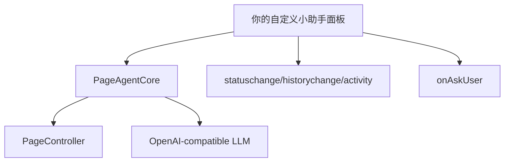

# 在自定义小助手面板中接入 Page Agent

https://github.com/alibaba/page-agent
本文档说明一个常见需求：**不使用项目自带的默认页面面板，而是在你自己的项目里写一个更轻量、更符合业务风格的小助手面板，然后接入 `Page Agent` 的能力。**

结论先说：**可以，而且从当前代码结构看，这是可行且比较自然的接入方式。**

## 一、先说结论：可以，但推荐分两种方式

## 方案 A：继续使用 `PageAgent`，忽略它自带的默认面板

这是最省事的方式。

优点：

- 直接复用官方对外入口
- `PageController`、`PageAgentCore`、默认工具都已经装配好
- 你只需要监听 agent 事件并自己渲染 UI

注意点：

- `PageAgent` 构造时会自动创建一个 `Panel`
- 这意味着默认面板实例仍然存在
- 如果你完全不想要它，体验上会略有冗余

适合：

- 想快速集成
- 可以接受默认面板被创建但不实际使用
- 更关心“先接通能力”

## 方案 B：直接基于 `PageAgentCore + PageController` 自己组装

这是更推荐的“纯自定义面板接入”方式。

优点：

- 完全不依赖默认 UI
- 不会创建官方 `Panel`
- 你的面板可以完全按业务需求设计
- 架构更干净

适合：

- 你明确希望完全不用默认面板
- 你要做自己的产品级 Copilot 界面
- 你希望完全掌控交互样式和体验

如果你的目标是“接入到其他项目里的小助手面板”，**更推荐方案 B**。

---

## 二、为什么可以这么做

从代码结构上看，默认面板并不是硬编码在 Agent Runtime 里，而是一个独立 UI 层。

### 关键事实 1：`PageAgent` 只是一个装配器

`packages/page-agent/src/PageAgent.ts` 的逻辑非常简单：

1. 创建 `PageController`
2. 继承 `PageAgentCore`
3. 创建一个 `Panel`

也就是说，默认面板不是底层能力的一部分，而是额外挂上去的 UI。

### 关键事实 2：`Panel` 依赖的是 `PanelAgentAdapter`，不是 `PageAgent` 本身

`packages/ui/src/panel/types.ts` 里定义了 `PanelAgentAdapter`。

这说明默认面板只要求 Agent 提供这些能力：

- `status`
- `history`
- `task`
- `execute()`
- `stop()`
- `dispose()`
- `onAskUser`
- 事件：`statuschange` / `historychange` / `activity` / `dispose`

这其实已经明确表达了设计意图：

> **Panel 是可替换的，Agent 运行时与 UI 是解耦的。**

### 关键事实 3：`PageAgentCore` 自己就是事件源

`PageAgentCore` 本身继承自 `EventTarget`，并会发出：

- `statuschange`
- `historychange`
- `activity`
- `dispose`

所以你的自定义 UI 根本不需要依赖官方 `Panel`，只需要订阅这些事件就可以了。

---

## 三、推荐接入方式

推荐你在自己的项目里直接使用：

- `PageAgentCore`
- `PageController`

由你自己创建一个轻量的小助手面板组件。

整体结构如下：



也就是：

- Agent 负责执行
- 你的 UI 负责展示和交互
- 两者通过事件和方法通信

---

## 四、最小接入代码

下面是一个最小可工作的接入示例。

### 1. 创建 agent 实例

```ts
import { PageAgentCore } from "@page-agent/core";
import { PageController } from "@page-agent/page-controller";

const pageController = new PageController({
  enableMask: true,
});

const agent = new PageAgentCore({
  pageController,
  baseURL: "https://your-llm-endpoint/v1",
  apiKey: "YOUR_API_KEY",
  model: "your-model-name",
  language: "zh-CN",
});
```

这样创建出来的实例：

- 有完整 Agent 能力
- 有完整页面控制能力
- **不会创建默认 `Panel`**

### 2. 在你的面板里监听状态

```ts
agent.addEventListener("statuschange", () => {
  console.log("status:", agent.status);
});

agent.addEventListener("historychange", () => {
  console.log("history:", agent.history);
});

agent.addEventListener("activity", (event) => {
  const detail = (event as CustomEvent).detail;
  console.log("activity:", detail);
});

agent.addEventListener("dispose", () => {
  console.log("agent disposed");
});
```

你自己的 UI 就可以据此刷新：

- 顶部状态文案
- 执行过程卡片
- 工具执行中的 loading
- 出错提示

### 3. 从你的输入框发起任务

```ts
async function runTask(task: string) {
  const result = await agent.execute(task);
  console.log("final result:", result);
}
```

### 4. 在你的停止按钮里终止任务

```ts
function stopTask() {
  agent.stop();
}
```

---

## 五、如果你的面板需要“向用户追问”

这点也可以完全自己接。

`PageAgentCore` 暴露了：

```ts
agent.onAskUser = async (question: string) => {
  // 打开你自己的输入框、弹窗或会话卡片
  const answer = await openYourCustomAskDialog(question);
  return answer;
};
```

这意味着：

- Agent 执行过程中如果调用 `ask_user`
- 不需要官方面板接管
- 你的自己的 UI 可以弹出问题并把答案回传

这是自定义面板接入里非常重要的一点。

---

## 六、你的小助手面板至少要接哪些数据

如果只是做一个最小可用版，建议你先接这几类状态：

### 1. Agent 状态

来自：

- `agent.status`
- `statuschange`

用途：

- 展示“待命 / 执行中 / 已完成 / 出错”
- 控制按钮文案（开始 / 停止）

### 2. 历史记录

来自：

- `agent.history`
- `historychange`

用途：

- 渲染执行日志
- 展示每一步 action
- 展示错误信息
- 展示 retry 信息

### 3. 即时活动

来自：

- `activity` 事件

可能的活动类型：

- `thinking`
- `executing`
- `executed`
- `retrying`
- `error`

用途：

- 顶部状态条
- typing/loading 动画
- 当前正在执行哪个工具

### 4. 用户追问

来自：

- `onAskUser`

用途：

- 在信息不足时让用户补充参数

---

## 七、推荐的小助手面板最小接口设计

如果你在 React / Vue / 原生 JS 里做一个自己的面板，建议先抽成下面这种最小状态模型。

```ts
type AssistantViewState = {
  status: "idle" | "running" | "completed" | "error";
  task: string;
  currentActivity?:
    | { type: "thinking" }
    | { type: "executing"; tool: string; input: unknown }
    | { type: "executed"; tool: string; output: string }
    | { type: "retrying"; attempt: number; maxAttempts: number }
    | { type: "error"; message: string };
  history: unknown[];
};
```

这样你的 UI 层就可以保持简单：

- 输入区
- 状态区
- 历史消息区
- 停止按钮
- 用户追问弹窗

---

## 八、推荐的 React 接入思路

如果你在 React 项目中接入，可以把 agent 当作一个外部事件源对待。

### 示例思路

```ts
useEffect(() => {
  const onStatus = () => setStatus(agent.status);
  const onHistory = () => setHistory([...agent.history]);
  const onActivity = (e: Event) => {
    setActivity((e as CustomEvent).detail);
  };

  agent.addEventListener("statuschange", onStatus);
  agent.addEventListener("historychange", onHistory);
  agent.addEventListener("activity", onActivity);

  return () => {
    agent.removeEventListener("statuschange", onStatus);
    agent.removeEventListener("historychange", onHistory);
    agent.removeEventListener("activity", onActivity);
  };
}, [agent]);
```

这样你的 React 组件就能跟随 agent 的状态自动刷新。

---

## 九、什么时候可以直接用 `PageAgent`，什么时候该用 `PageAgentCore`

## 可以直接用 `PageAgent` 的情况

- 你只想快速验证功能
- 不介意默认面板实例被创建
- 你打算自己写一层简单 UI，但不想自己拼装 controller

## 更推荐用 `PageAgentCore + PageController` 的情况

- 你明确不想使用默认面板
- 你希望结构更干净
- 你要做正式产品接入
- 你想完全掌控 UI 生命周期

如果你现在是在“其他项目里做一个自己的助手面板”，**建议优先选 `PageAgentCore + PageController`。**

---

## 十、接入时的几个注意事项

### 1. `ask_user` 工具默认依赖 `onAskUser`

如果你不设置：

```ts
agent.onAskUser = ...
```

那么 `ask_user` 工具会被禁用。

如果你的任务流程可能需要中途追问，记得实现它。

### 2. `stop()` 只停止任务，不销毁实例

```ts
agent.stop();
```

作用是：

- 中止当前任务
- 清理高亮
- 隐藏遮罩

但 agent 本身仍然可复用。

### 3. `dispose()` 是彻底销毁

如果你的页面卸载、路由切换、组件销毁，建议在适当时机调用：

```ts
agent.dispose();
```

避免事件监听残留。

### 4. 遮罩和高亮是 `PageController` 能力，不是面板能力

是否显示遮罩，主要由 `PageController` 配置控制，例如：

```ts
const pageController = new PageController({
  enableMask: true,
});
```

所以即使你不用默认面板，遮罩能力仍然可以照常使用。

### 5. 页面上的索引数字和高亮标签可以隐藏

执行步骤时，页面上那些可交互元素的编号标签和高亮效果，来自 `PageController` 的 DOM 高亮能力，而不是默认面板本身。

如果你觉得这些编号“花里胡哨”，希望在正式产品里隐藏，可以在创建 `PageController` 时这样配置：

```ts
const pageController = new PageController({
  enableMask: true,
  highlightOpacity: 0,
  highlightLabelOpacity: 0,
});
```

这两个配置的作用分别是：

- `highlightOpacity: 0`
  - 隐藏元素区域的高亮底色
- `highlightLabelOpacity: 0`
  - 隐藏页面上的索引数字标签

如果你只想隐藏索引数字，但希望保留一点高亮引导，也可以只设置：

```ts
const pageController = new PageController({
  enableMask: true,
  highlightLabelOpacity: 0,
});
```

推荐在正式接入自己的小助手面板时使用：

```ts
const pageController = new PageController({
  enableMask: true,
  highlightOpacity: 0,
  highlightLabelOpacity: 0,
});
```

这样可以做到：

- 保留执行中的遮罩保护
- 隐藏页面上的调试感编号
- 让整体体验更接近产品化 UI

### 6. 你可以继续扩展自己的工具

即使使用自定义面板，也不影响你用：

- `customTools`
- `instructions`
- `transformPageContent`
- `customSystemPrompt`

面板只是 UI，Agent 的核心扩展能力完全保留。

---

## 十一、推荐的接入步骤

建议按这个顺序做：

1. 在你的项目里先创建 `PageController`
2. 创建 `PageAgentCore`
3. 接入一个最小输入框和“开始/停止”按钮
4. 监听 `statuschange` / `historychange` / `activity`
5. 实现 `onAskUser`
6. 最后再美化你自己的助手面板样式

这样最稳。

---

## 十二、最短可执行接入示例

```ts
import { PageAgentCore } from "@page-agent/core";
import { PageController } from "@page-agent/page-controller";

const controller = new PageController({ enableMask: true });

const agent = new PageAgentCore({
  pageController: controller,
  baseURL: "https://your-llm-endpoint/v1",
  apiKey: "YOUR_API_KEY",
  model: "your-model",
  language: "zh-CN",
});

agent.onAskUser = async (question) => {
  return window.prompt(question) || "";
};

agent.addEventListener("activity", (e) => {
  console.log("activity", (e as CustomEvent).detail);
});

agent.addEventListener("historychange", () => {
  console.log("history", agent.history);
});

async function start() {
  const result = await agent.execute("帮我点击登录按钮");
  console.log(result);
}

function stop() {
  agent.stop();
}
```

---

## 十三、最终建议

如果你的目标是：

> **在其他项目里做一个自己的 AI 小助手面板，并复用 Page Agent 的页面操作能力**

那么最合适的方式是：

> **不要直接依赖默认 `Panel`，而是直接基于 `PageAgentCore + PageController` 自己接 UI。**

这是当前项目架构下最自然、最干净、也最容易长期维护的接法。
